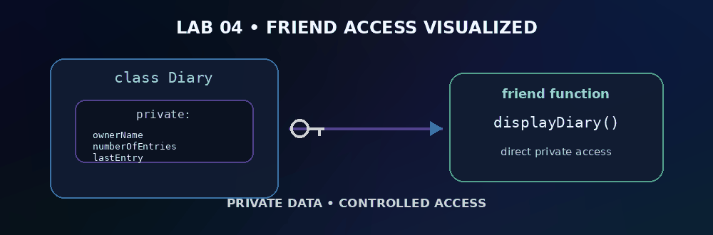

<div align="center">

# 🧪 OOP Laboratory — Lab 04

## Friend Function & Friend Class

**C++ • 10 Programs • IIIT Bhubaneswar**

Controlled access to private class data using C++ friendship.

`Friend functions` • `Friend classes` • `Private access` • `Object collaboration`

</div>


<div align="center">

</div>

## 📋 Problem Index

| # | Problem | Source |
|:---:|---|:---:|
| **01** | Personal Diary | [`L4P1.cpp`](./L4P1.cpp) |
| **02** | Mobile Phone Settings | [`L4P2.cpp`](./L4P2.cpp) |
| **03** | Parking Slot | [`L4P3.cpp`](./L4P3.cpp) |
| **04** | Music Playlist | [`L4P4.cpp`](./L4P4.cpp) |
| **05** | Food Order | [`L4P5.cpp`](./L4P5.cpp) |
| **06** | Smart Door Lock | [`L4P6.cpp`](./L4P6.cpp) |
| **07** | Game Player Status | [`L4P7.cpp`](./L4P7.cpp) |
| **08** | Train Seat Status | [`L4P8.cpp`](./L4P8.cpp) |
| **09** | Online Exam Result | [`L4P9.cpp`](./L4P9.cpp) |
| **10** | Smart Home Device | [`L4P10.cpp`](./L4P10.cpp) |

---

## 🎯 What This Lab Builds

This lab focuses on **friend function & friend class** through small, independent programs. Each solution keeps the implementation direct and readable so the class design and logic are easy to explain during evaluation.

### Key ideas

- Friend functions
- Friend classes
- Private access
- Object collaboration

---

## ▶️ Compile & Run

```bash
g++ -std=c++17 L4P1.cpp -o L4P1
./L4P1
```

> Replace `P1` with the required problem number.

---

<div align="center">

[⬅️ Back to Main Repository](../README.md)


**Lab 04 • Friend Function & Friend Class**

</div>
