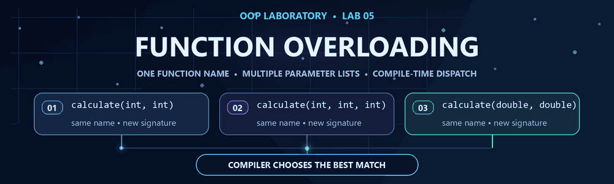
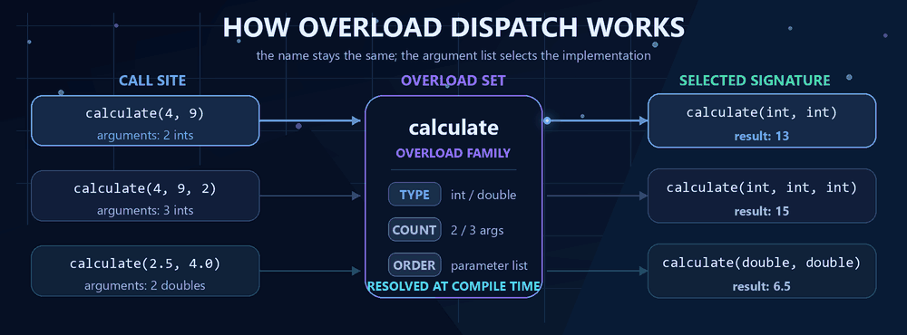

<div align="center">

# 🧪 OOP Laboratory — Lab 05

## Function Overloading

**C++ • 10 Programs • IIIT Bhubaneswar**

One function name, multiple parameter lists, and the compiler choosing the best match.

`Compile-time polymorphism` • `Overload resolution` • `Arrays` • `Pointers`

</div>

<picture>
  <source media="(prefers-reduced-motion: reduce)" srcset="../assets/lab5_function_overloading_preview.png">
  
</picture>

## 📋 Problem Index

| # | Problem | Overloading focus | Source |
|:---:|---|---|:---:|
| **01** | Number Calculator | Two integers, three integers, two floating-point values | [`L5P1.cpp`](./L5P1.cpp) |
| **02** | Value Comparison | Two integers, two floating-point values, three integers | [`L5P2.cpp`](./L5P2.cpp) |
| **03** | Array Total | Integer array, floating-point array, partial integer array | [`L5P3.cpp`](./L5P3.cpp) |
| **04** | Element Search | Integer array, character array, ranged integer search | [`L5P4.cpp`](./L5P4.cpp) |
| **05** | Modify a Value | Integer, floating-point value, integer pointer | [`L5P5.cpp`](./L5P5.cpp) |
| **06** | Display Data | Scalar values plus integer and character arrays | [`L5P6.cpp`](./L5P6.cpp) |
| **07** | Compare Data Sets | Integers, floating-point values, equal-sized arrays | [`L5P7.cpp`](./L5P7.cpp) |
| **08** | Counting Operation | Digits, array elements, character occurrences | [`L5P8.cpp`](./L5P8.cpp) |
| **09** | Maximum Value Finder | Integers, integer pointers, pointer-based array | [`L5P9.cpp`](./L5P9.cpp) |
| **10** | Overloaded Data Processor | Mixed scalars, array with size, two pointers | [`L5P10.cpp`](./L5P10.cpp) |

---

## 🎯 The Core Idea

**Function overloading** lets several functions share a name when their parameter lists are different. At the call site, the compiler examines the arguments and selects the best viable signature. This decision is made at compile time, so overloading is also called **compile-time polymorphism**.

```cpp
int calculate(int first, int second);
int calculate(int first, int second, int third);
double calculate(double first, double second);

calculate(4, 9);       // selects calculate(int, int)
calculate(4, 9, 2);    // selects calculate(int, int, int)
calculate(2.5, 4.0);   // selects calculate(double, double)
```

<picture>
  <source media="(prefers-reduced-motion: reduce)" srcset="../assets/overload_dispatch_preview.png">
  
</picture>

### How the signatures differ

| Distinguishing rule | Example overloads | What the compiler checks |
|---|---|---|
| **Number of parameters** | `calculate(int, int)` / `calculate(int, int, int)` | Two arguments versus three |
| **Parameter type** | `calculate(int, int)` / `calculate(double, double)` | Integer arguments versus floating-point arguments |
| **Parameter order** | `process(int, double)` / `process(double, int)` | The left-to-right type sequence |
| **Pointer versus value/reference** | `modify(int&, int)` / `modify(int*, int)` | An integer object versus its address |
| **Extra size or range data** | `search(const int*, std::size_t, int)` / `search(const int*, std::size_t, int, std::size_t, std::size_t)` | Whole-array search versus bounded search |

> The return type alone cannot distinguish overloaded functions. The parameter list must be different.

---

## 🧭 A Reliable Way to Read Each Program

1. Find the repeated function name.
2. Compare each parameter list by **count, type, and order**.
3. Look at the arguments used in `main()`.
4. Match each call to the signature the compiler will select.
5. Verify that the displayed result comes from that overload.

This same-name/different-signature pattern is the important part of every solution in this lab.

---

## ▶️ Compile & Run

Open a terminal in the `LAB 5` folder and compile any one program:

```bash
g++ -std=c++17 -Wall -Wextra -pedantic L5P1.cpp -o L5P1
./L5P1
```

On Windows PowerShell, run the generated executable with:

```powershell
.\L5P1.exe
```

Replace `P1` with the required problem number, from `P1` through `P10`.

---

## 🎓 Viva Quick Notes

- **What is function overloading?** Defining multiple functions with the same name but different parameter lists.
- **When is the function selected?** At compile time, through overload resolution.
- **Can return type alone create an overload?** No. Calls usually do not provide enough information to select by return type.
- **What can differ?** Parameter count, parameter types, or parameter order.
- **What is an ambiguous call?** A call for which two or more overloads are equally good matches.
- **Are `int values[]` and `int* values` different parameters?** Not in a function parameter list; the array form is adjusted to a pointer. Add a size or another distinguishing parameter where needed.
- **Overloading versus overriding?** Overloading uses different signatures, usually in the same scope. Overriding replaces a virtual base-class function in a derived class.
- **Why pass an array size separately?** A pointer parameter does not carry the number of array elements.
- **Why use a pointer overload?** It demonstrates that the function can operate on a value through its address and that pointer type participates in overload resolution.
- **Why is overloading useful?** It gives related operations one clear interface while keeping type-specific implementations separate.

---

## 🎞️ Visual Assets

- [Function-overloading banner (GIF)](../assets/lab5_function_overloading.gif) · [static PNG](../assets/lab5_function_overloading_preview.png)
- [Overload-dispatch explainer (GIF)](../assets/overload_dispatch.gif) · [static PNG](../assets/overload_dispatch_preview.png)
- [Five-lab learning journey (GIF)](../assets/oop_journey_lab5.gif) · [static PNG](../assets/oop_journey_lab5_preview.png)

---

<div align="center">

[📦 Standalone Package Home](../README.md) &nbsp; • &nbsp; **Lab 06 — Coming next**


**Lab 05 • Function Overloading • Compile-Time Polymorphism**

</div>
