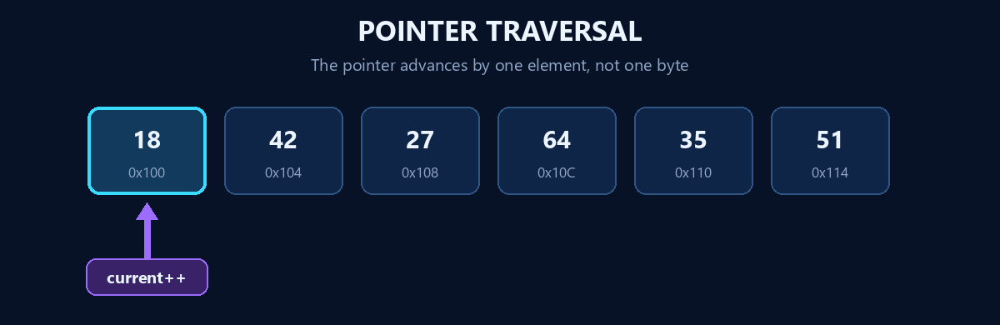

<div align="center">

# 🧪 OOP Laboratory — Lab 06

## Test on C++ Pointers — Set B

**C++17 • 10 Programs • IIIT Bhubaneswar • 01 September 2026**

`Address-of` • `Dereferencing` • `Pointer arithmetic` • `Dynamic memory`

<picture>
  <source media="(prefers-reduced-motion: reduce)" srcset="../assets/lab6_pointer_memory_preview.png">
  
</picture>

</div>

## 📋 Problem Index

| # | Problem | Pointer focus | Source |
|:---:|---|---|:---:|
| **01** | Mobile Battery Update | Modify one variable only through a pointer | [`L6P1.cpp`](./L6P1.cpp) |
| **02** | Water Tank Level | Read and update a value by dereferencing | [`L6P2.cpp`](./L6P2.cpp) |
| **03** | Sports Equipment Rack | Traverse six IDs with pointer arithmetic | [`L6P3.cpp`](./L6P3.cpp) |
| **04** | Train Seat Correction | Update a user-selected position without `array[position]` | [`L6P4.cpp`](./L6P4.cpp) |
| **05** | Online Order Status | Pass an address to `updateStatus(int*)` | [`L6P5.cpp`](./L6P5.cpp) |
| **06** | Podcast Duration Analyzer | Find a maximum using pointer traversal | [`L6P6.cpp`](./L6P6.cpp) |
| **07** | Text Analyzer | Traverse a null-terminated character array | [`L6P7.cpp`](./L6P7.cpp) |
| **08** | Classroom Marks Update | Modify the original array through a function pointer | [`L6P8.cpp`](./L6P8.cpp) |
| **09** | Restaurant Table Manager | Allocate, traverse, and release a dynamic array | [`L6P9.cpp`](./L6P9.cpp) |
| **10** | Contact Number Search | Search dynamic memory without array indexing | [`L6P10.cpp`](./L6P10.cpp) |

## 🧠 Pointer Model

A pointer stores an address. Dereferencing that pointer accesses the value at the address.

```cpp
int batteryPercentage = 45;
int* batteryPointer = &batteryPercentage;

std::cout << *batteryPointer;  // reads 45
*batteryPointer += 20;         // batteryPercentage is now 65
```

For arrays, the array name points to the first element. Adding an offset moves by whole elements:

```cpp
int equipmentIds[] = {101, 102, 103};
int* firstEquipment = equipmentIds;

std::cout << *(firstEquipment + 2);  // prints 103
```

<picture>
  <source media="(prefers-reduced-motion: reduce)" srcset="../assets/pointer_traversal_preview.png">
  
</picture>

## 🔍 Problem Notes

### 01–02 · Pointers to individual variables

The battery and water-level programs use `&` to capture an address and `*` to read or update the original variable. No copy is modified.

### 03–04 · Pointer arithmetic on fixed arrays

The equipment and seat programs use expressions such as `*(firstElement + offset)`. The correction program converts a human-friendly 1-based position into a zero-based pointer offset.

### 05–08 · Pointers passed to functions

A function receiving `int*` can update the caller's original object. Read-only traversal uses `const int*` or `const double*` to prevent accidental modification.

### 09–10 · Dynamic arrays

The number of elements is known only at runtime, so memory is created with `new[]`. Both programs release the same allocation with `delete[]` and clear the pointer afterward.

```cpp
int* values = new int[elementCount];
// use values...
delete[] values;
values = nullptr;
```

## ▶️ Compile & Run

Open a terminal in the `LAB 6` folder and compile one exercise at a time:

```bash
g++ -std=c++17 -Wall -Wextra -pedantic L6P1.cpp -o L6P1
./L6P1
```

Replace `P1` with `P2` through `P10`. On Windows PowerShell, run `.\L6P1.exe`.

To compile all ten programs in PowerShell:

```powershell
1..10 | ForEach-Object {
    g++ -std=c++17 -Wall -Wextra -pedantic "L6P$_.cpp" -o "L6P$_.exe"
}
```

## 🎓 Viva Quick Notes

- **What does `&value` return?** The memory address of `value`.
- **What does `*pointer` mean?** It dereferences the pointer to access the stored value.
- **What does `pointer + 1` do?** It advances to the next object of the pointed-to type.
- **Why pass a pointer to a function?** To let the function access or modify the caller's original data.
- **Why provide an array size separately?** A pointer stores an address, not the number of elements.
- **What marks the end of a C-style string?** The null character `\0`.
- **Why use `delete[]`?** Memory created with `new[]` must be released with the matching array form.
- **What is a dangling pointer?** A pointer that still holds the address of memory that is no longer valid.
- **Why assign `nullptr` after deletion?** It makes the pointer explicitly point to nothing and reduces accidental reuse.

## ✅ Requirement Checklist

- [x] All programs use C++
- [x] Pointer dereferencing is used where required
- [x] Restricted questions avoid array indexing
- [x] Original arrays are modified through pointers
- [x] Dynamic arrays are released with `delete[]`
- [x] Output labels are clear and readable
- [x] Descriptive variable names and explanatory comments are included

---

<div align="center">

[← Repository Home](../README.md) • **Lab 06 — C++ Pointers**

</div>
