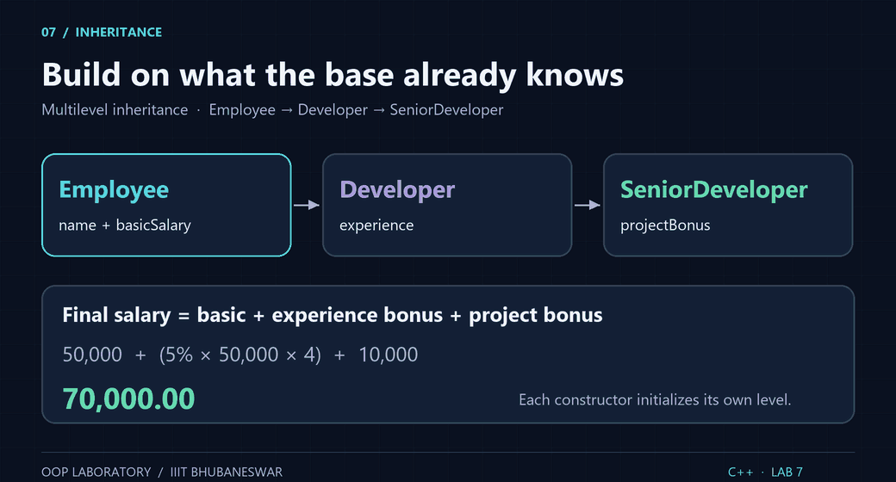
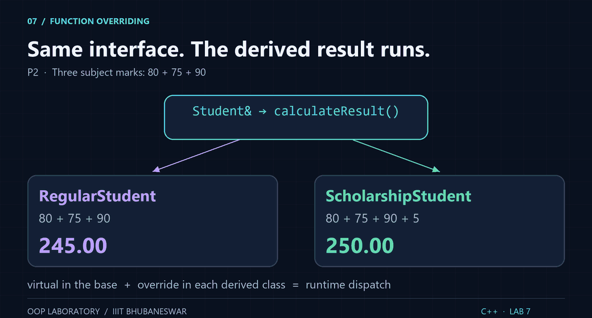
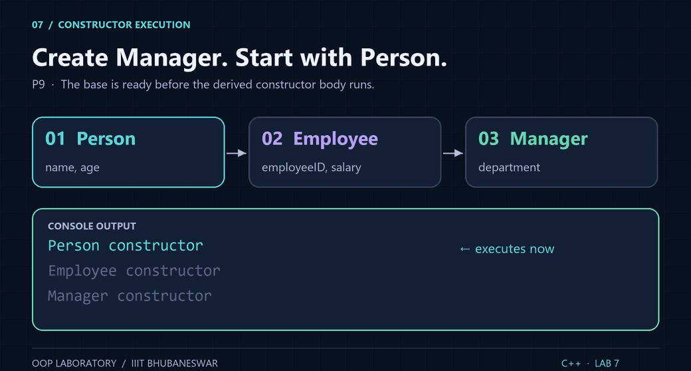
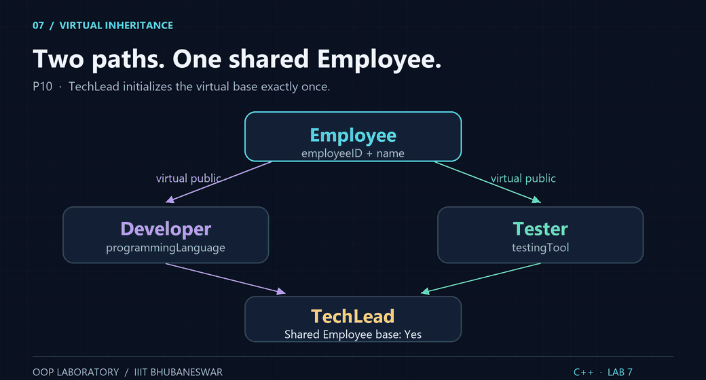

<div align="center">

# Lab 7 · Inheritance

**C++17 · 10 exercises · Group B2 · 6 October 2026**

IIIT Bhubaneswar · B.Tech 3rd Semester · OOP Laboratory

<picture>
  <source media="(prefers-reduced-motion: reduce)" srcset="../assets/lab7_inheritance_preview.png">
  
</picture>

[Repository home](../README.md) · [Previous: Lab 6](../LAB%206/) · [Sample files](./samples/)

</div>

These ten independent programs implement the questions in **OOP_LAB_7_CSE_B2.pdf**. Each uses `#include <iostream>` and `using namespace std;`. Other standard headers supply strings, decimal formatting and finite-number checks. Comments explain base initialization, overriding, access control and virtual inheritance.

## Exercise index

| # | Exercise | Required structure or concept | Source |
|:---:|:---|:---|:---:|
| 1 | Employee salary | `Employee → Developer → SeniorDeveloper` | [L7P1.cpp](./L7P1.cpp) |
| 2 | Student result | `Student → RegularStudent / ScholarshipStudent`; overriding | [L7P2.cpp](./L7P2.cpp) |
| 3 | Vehicle rental | `Vehicle → Car → LuxuryCar` | [L7P3.cpp](./L7P3.cpp) |
| 4 | Banking system | `BankAccount → SavingsAccount / CurrentAccount` | [L7P4.cpp](./L7P4.cpp) |
| 5 | Student performance | `Academic + Sports → StudentResult` | [L7P5.cpp](./L7P5.cpp) |
| 6 | Resolve ambiguity | `InternalExam + ExternalExam → FinalResult`; `Base::display()` | [L7P6.cpp](./L7P6.cpp) |
| 7 | University personnel | `Person → Student / Employee → TeachingAssistant`; virtual base | [L7P7.cpp](./L7P7.cpp) |
| 8 | Hospital system | `Patient → InPatient`; protected patient data | [L7P8.cpp](./L7P8.cpp) |
| 9 | Constructor execution | `Person → Employee → Manager` | [L7P9.cpp](./L7P9.cpp) |
| 10 | Diamond problem | `Employee → Developer / Tester → TechLead`; virtual base | [L7P10.cpp](./L7P10.cpp) |

## Compile and run

Open a terminal in this folder. Compile **one exercise at a time** because each file defines its own `main()`.

```bash
g++ -std=c++17 -Wall -Wextra -pedantic L7P1.cpp -o L7P1
./L7P1
```

Windows PowerShell:

```powershell
g++ -std=c++17 -Wall -Wextra -pedantic L7P1.cpp -o L7P1.exe
if ($LASTEXITCODE -ne 0) { throw "Compilation failed" }
.\L7P1.exe
```

Replace `P1` with `P2` through `P10`. Compile all ten into separate executables with:

```powershell
New-Item -ItemType Directory -Force build | Out-Null
1..10 | ForEach-Object {
    g++ -std=c++17 -Wall -Wextra -pedantic "L7P$_.cpp" -o "build/L7P$_.exe"
    if ($LASTEXITCODE -ne 0) { throw "Compilation failed for L7P$_.cpp" }
}
.\build\L7P1.exe
```

## Sample inputs and results

**↵ means press Enter.** Names and departments can contain spaces. Where prompted, IDs are single tokens; P2 roll numbers and all P10 fields use whole lines. Monetary values and results print with two decimal places.

| Program | Input in prompt order | Key result | Recorded run |
|:---|:---|:---|:---:|
| P1 | `Asha Das` ↵ `50000 4 10000` | Experience bonus `10000.00`; final salary `70000.00` | [Input](./samples/L7P1.in.txt) / [Output](./samples/L7P1.out.txt) |
| P2 | `Ravi Kumar` ↵ `B425001` ↵ `80 75 90` ↵ `Asha Das` ↵ `B425050` ↵ `80 75 90` | Regular `245.00`; scholarship `250.00` | [Input](./samples/L7P2.in.txt) / [Output](./samples/L7P2.out.txt) |
| P3 | `OD 02 AB 1234` ↵ `3 2000 500` | Rental cost `7500.00` | [Input](./samples/L7P3.in.txt) / [Output](./samples/L7P3.out.txt) |
| P4 | `00101` ↵ `10000 5` ↵ `00202` ↵ `2000 3000 100` | Savings `10500.00`; current `1900.00` | [Input](./samples/L7P4.in.txt) / [Output](./samples/L7P4.out.txt) |
| P5 | `80 75 90 95` | Academic `245.00`; total `340.00`; average `85.00` | [Input](./samples/L7P5.in.txt) / [Output](./samples/L7P5.out.txt) |
| P6 | `25 65` | Internal `25.00`; external `65.00` | [Input](./samples/L7P6.in.txt) / [Output](./samples/L7P6.out.txt) |
| P7 | `Asha Das` ↵ `21 B425050 9.2 TA101 15000` | All six fields; shared Person base `Yes` | [Input](./samples/L7P7.in.txt) / [Output](./samples/L7P7.out.txt) |
| P8 | `Ravi Kumar` ↵ `P101 35 2500 4` | Hospital bill `10000.00` | [Input](./samples/L7P8.in.txt) / [Output](./samples/L7P8.out.txt) |
| P9 | `Asha Das` ↵ `35 E101 80000` ↵ `Software Development` | Person, Employee, Manager constructors, then all details | [Input](./samples/L7P9.in.txt) / [Output](./samples/L7P9.out.txt) |
| P10 | `E501` ↵ `Ravi Kumar` ↵ `C++` ↵ `Selenium WebDriver` | All fields; shared Employee base `Yes` | [Input](./samples/L7P10.in.txt) / [Output](./samples/L7P10.out.txt) |

Recorded outputs are captured with redirected input. Prompts therefore appear together where an interactive terminal would normally echo typed input.

## Formulas and choices left open by the sheet

- **P1:** `experienceBonus = 0.05 * basicSalary * experience`; `finalSalary = basicSalary + experienceBonus + projectBonus`. Experience uses whole years.
- **P2:** subject count is unspecified, so both types use three subjects out of 100 each. The scholarship bonus adds **5 to the total**, even when the unadjusted total is 300; no cap was requested. `calculateResult()` is pure virtual in the base and overridden in both derived classes.
- **P3:** `(dailyRate + luxuryCharge) * rentalDays`. Zero days is allowed.
- **P4:** interest rate, minimum balance and fee are entered by the user. Apply interest **once** with `balance * rate / 100`. Deduct the current-account fee **only when balance < minimumBalance**. Deduct the full fee as specified; it can produce a negative balance if the fee exceeds the balance because no overdraft rule was supplied.
- **P5:** three academic marks and sports marks are each out of 100. `total = academicTotal + sportsMarks`; `average = total / 4.0` avoids integer truncation.
- **P6:** both exam marks use a 0–100 scale for this demonstration. Select both base functions explicitly; no weighting or combined-result formula is invented.
- **P7:** CGPA uses a 0–10 scale. `Student` and `Employee` virtually inherit `Person`; `TeachingAssistant` initializes the shared base.
- **P8:** interpret room charges as a daily rate: `roomCharges * numberOfDays`. Patient name, ID and age remain **protected** and are accessed directly inside `InPatient`.
- **P9:** own data members are unspecified. Name/age, employee ID/salary and department illustrate the three levels.
- **P10:** `Developer` and `Tester` virtually inherit `Employee`; `TechLead` initializes it.

Amounts must be finite and non-negative on input; age, experience and days use non-negative `int` values. Invalid or missing input returns a nonzero status. Arithmetic overflow is reported in P1, P3, P4 and P8. `double` is used for these classroom calculations; displayed amounts round to two decimals.

## See the inheritance work

### Overriding: one interface, two results

<picture>
  <source media="(prefers-reduced-motion: reduce)" srcset="../assets/lab7_overriding_preview.png">
  
</picture>

Overriding requires a virtual base function and a matching derived signature. P2 calls through `const Student&` references, so the derived implementations determine the results. This differs from Lab 5's overload selection by parameter list.

### Constructors: base before derived

<picture>
  <source media="(prefers-reduced-motion: reduce)" srcset="../assets/lab7_constructor_order_preview.png">
  
</picture>

The base subobject exists before the derived constructor body uses it. P9 prints the three constructor messages in that order, then the complete manager information.

### Virtual inheritance: one shared base

<picture>
  <source media="(prefers-reduced-motion: reduce)" srcset="../assets/lab7_virtual_diamond_preview.png">
  
</picture>

```cpp
class Developer : virtual public Employee { /* ... */ };
class Tester : virtual public Employee { /* ... */ };
class TechLead : public Developer, public Tester { /* ... */ };
```

Without virtual inheritance, the two paths contain two `Employee` subobjects. With it, `TechLead` contains one. P7 and P10 compare base pointers reached through both paths to demonstrate that they refer to the same subobject.

## Viva quick notes

| Question | Answer |
|:---|:---|
| What is multilevel inheritance? | A derived class becomes the base of another, as in P1, P3 and P9. |
| What is hierarchical inheritance? | Several derived classes share a base, as in P4. |
| What is multiple inheritance? | A class directly inherits from more than one base, as in P5 and P6. |
| What is hybrid inheritance? | A combination of inheritance structures, such as P7's diamond. |
| Why use `override`? | The compiler checks that the derived function overrides a base virtual function. |
| Are virtual functions and virtual inheritance the same? | No. Virtual functions control runtime dispatch; virtual inheritance shares a base subobject. |
| How is ambiguity resolved in P6? | With `InternalExam::display()` and `ExternalExam::display()`. |
| Who initializes a virtual base? | The most-derived class: `TeachingAssistant` or `TechLead` here. |
| Can `main()` access protected patient data? | No. Member functions of the class and its derived classes can access it. |
| What executes first in ordinary multilevel construction? | The base constructor, followed by the derived constructors. |

## Verification and assets

From the repository root, run `python scripts/verify_lab7.py` with GCC available. It compiles all ten sources with warnings treated as errors, checks sample and boundary results, verifies constructor order and both shared-base demonstrations, and compares outputs against the recorded samples. Temporary executables stay outside source folders.

All diagrams are local GIFs with PNG alternatives for reduced-motion preferences. [Asset guide](../assets/README.md) · [Rebuild animations](../scripts/generate_lab7_assets.py)

---

[← Lab 6](../LAB%206/) · [Repository home](../README.md) · [Lab Exam-1](../Lab%20Exam-1/)
