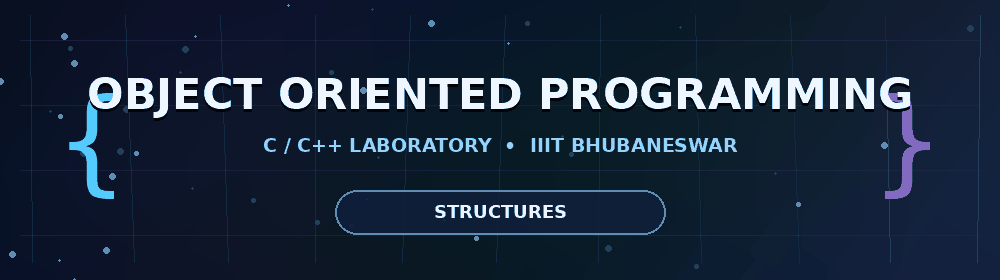
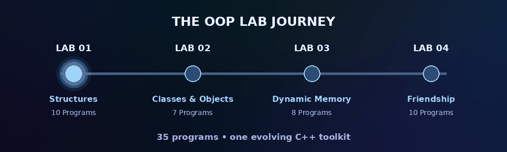
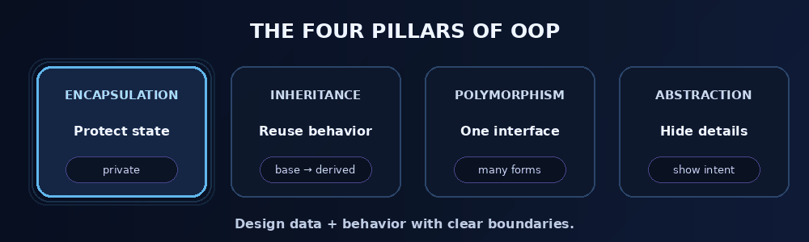

<div align="center">



<br>

[](#-lab-navigator)
[](#-lab-navigator)
[](#-about-this-repository)
[](#)

### `B.Tech • Computer Science & Engineering • OOP Laboratory`

*A growing collection of clean, readable programs built while learning object-oriented thinking from the ground up.*

</div>

---

## 🧭 About This Repository

This repository contains my **Object Oriented Programming Laboratory** work. The labs progress from structured data representation in C to core C++ ideas such as classes, objects, dynamic memory, friend functions, and friend classes.

The focus is not only on getting the output right, but also on keeping each program **simple, readable, properly named, and easy to understand during lab evaluation or viva**.

<div align="center">

</div>

---

## 🧪 Lab Navigator

| Lab | Core Topic | Programs | Language | Status | Open |
|:---:|---|:---:|:---:|:---:|:---:|
| **01** | Structures & Records | **10** | C | ✅ | [Explore](./LAB%201/) |
| **02** | Classes, Objects & Member Functions | **7** | C++ | ✅ | [Explore](./LAB%202/) |
| **03** | Dynamic Memory Allocation | **8** | C++ | ✅ | [Explore](./LAB%203/) |
| **04** | Friend Function & Friend Class | **10** | C++ | ✅ | [Explore](./LAB%204/) |

<div align="center">

### **35 Programs • 4 Labs • One OOP Journey**

</div>


## 🧠 Concepts Covered

<table>
<tr>
<td width="50%" valign="top">

### 🧱 Foundations
- Structures and records
- Classes and objects
- Private data members
- Member functions
- Object-based problem solving

</td>
<td width="50%" valign="top">

### ⚙️ Memory & Access
- Dynamic variables and arrays
- Dynamic objects
- Object arrays
- Friend functions
- Friend classes
- Controlled private access

</td>
</tr>
</table>

<div align="center">

</div>

---

## 🔐 Friendship in C++

Lab 4 introduces a very useful C++ idea: a class can selectively allow an external function or another class to access its private members.

<div align="center">

</div>

```cpp
class Player {
private:
    string playerName;
    int health, score, level;

    friend class GameManager;
};
```

> `friend` does not make data public. It grants access only to the specifically declared function or class.

---

## 💻 Code Style

Every solution aims to follow the same lab-friendly style:

- **Meaningful variable names** instead of cryptic one-letter names where possible.
- **Private data members** where the question expects encapsulation.
- **Simple constructors and member functions** without unnecessary complexity.
- **Student-style comments** explaining important steps naturally.
- **Readable output formatting** so results are easy to verify.
- **One problem per source file** for clean submission and revision.

<div align="center">

</div>

---

## 📂 Repository Layout

```text
b425050/
│
├── README.md
├── assets/
│   ├── oop_banner.gif
│   ├── oop_journey.gif
│   ├── friend_access.gif
│   ├── oop_pillars.gif
│   ├── cpp_terminal.gif
│   └── animated_divider.gif
│
├── LAB 1/
│   ├── README.md
│   └── L1P1.c ... L1P10.c
│
├── LAB 2/
│   ├── README.md
│   └── L2P1.cpp ... L2P7.cpp
│
├── LAB 3/
│   ├── README.md
│   └── L3P1.cpp ... L3P8.cpp
│
└── LAB 4/
    ├── README.md
    └── L4P1.cpp ... L4P10.cpp
```

---

## 🛠️ Compile & Run

For C programs:

```bash
gcc L1P1.c -o L1P1
./L1P1
```

For C++ programs:

```bash
g++ L4P1.cpp -o L4P1
./L4P1
```

Or with a modern standard explicitly enabled:

```bash
g++ -std=c++17 L4P1.cpp -o L4P1
./L4P1
```

---

## 📈 Learning Progress

```text
Structured Data       ██████████  Lab 01
Classes & Objects     ██████████  Lab 02
Dynamic Memory        ██████████  Lab 03
Friendship            ██████████  Lab 04
More OOP Concepts     ░░░░░░░░░░  Incoming...
```

The repository will continue growing as more OOP concepts are introduced in future laboratory sessions.

---

<div align="center">

### ✨ Build objects. Protect state. Design relationships. Write cleaner code.


**Object Oriented Programming Laboratory • IIIT Bhubaneswar**

</div>
