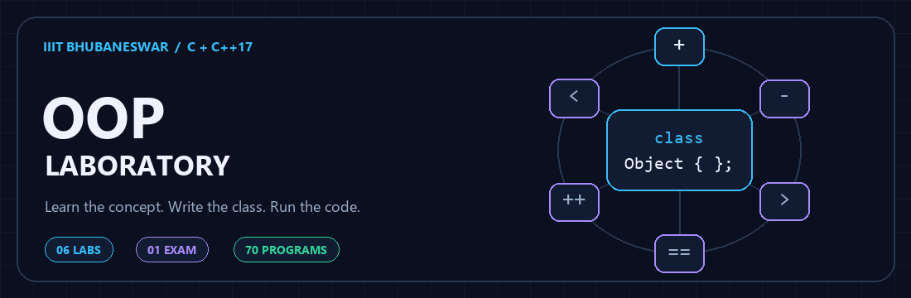
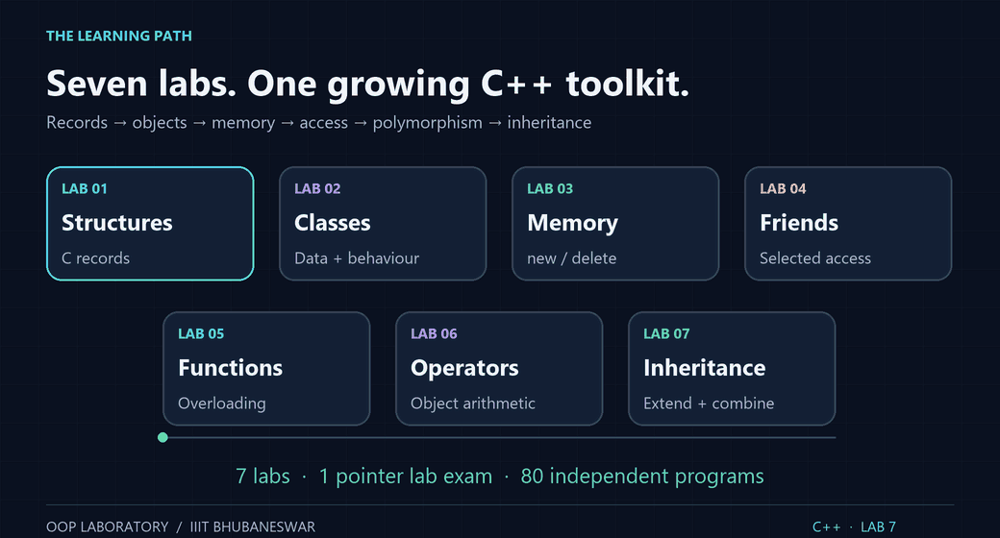

<div align="center">

<picture>
  <source media="(prefers-reduced-motion: reduce)" srcset="assets/oop_lab_banner_preview.png">
  
</picture>

# Object-Oriented Programming Laboratory

**Small programs. Clear concepts. Learn C++ by running it.**


**IIIT Bhubaneswar** · Object Oriented Programming · C / C++

[Explore the labs](#laboratory-map) · [New: Lab 7](./LAB%207/) · [Lab Exam-1](./Lab%20Exam-1/) · [Run a program](#quick-start)

</div>

## Laboratory map

Seven labs and one lab exam, with ten independent programs in each folder. Start with records, then work through classes, memory, overloading and inheritance.

| Module | What you will practise | Concepts | Open |
|:---|:---|:---|:---:|
| **01 · Structures & Records** | Organise related data | Structures · nested records · arrays | [Lab 1 →](./LAB%201/) |
| **02 · Classes & Objects** | Model data and behaviour together | Encapsulation · private data · member functions | [Lab 2 →](./LAB%202/) |
| **03 · Dynamic Memory** | Allocate arrays and objects at runtime | `new` · `delete` · matrices · records | [Lab 3 →](./Lab3/) |
| **04 · Friends** | Give selected functions and classes private access | Friend functions · friend classes | [Lab 4 →](./LAB%204/) |
| **05 · Function Overloading** | Give one function name multiple signatures | Parameters · overload resolution | [Lab 5 →](./LAB%205/) |
| **06 · Operator Overloading** | Add, compare and update objects | `+` · `-` · `>` · `<` · `++` · `==` | [Lab 6 →](./LAB%206/) |
| **07 · Inheritance** | Extend classes and combine their capabilities | Multilevel · multiple · overriding · virtual bases | [Lab 7 →](./LAB%207/) |
| **Lab Exam-1 · C++ Pointers** | Trace addresses and traverse arrays | Dereferencing · pointer arithmetic · dynamic arrays | [Exam →](./Lab%20Exam-1/) |

> The earlier pointer-based `LAB 6` is now **[Lab Exam-1](./Lab%20Exam-1/)**, using `LE1P1.cpp`–`LE1P10.cpp`. **[Lab 6](./LAB%206/)** covers operator overloading; **[Lab 7](./LAB%207/)** follows the inheritance worksheet dated **6 October 2026**, Group **B2**.

<picture>
  <source media="(prefers-reduced-motion: reduce)" srcset="assets/oop_journey_lab7_preview.png">
  
</picture>

## In focus: inheritance that you can trace

Lab 7 contains ten commented, interactive solutions. Every new source includes `#include <iostream>` and `using namespace std;`, with additional standard headers where needed. Its guide explains formulas, input choices, sample runs and common viva questions.

<picture>
  <source media="(prefers-reduced-motion: reduce)" srcset="assets/lab7_inheritance_preview.png">
  
</picture>

| Extend one chain | Combine independent bases | Share one common base |
|:---|:---|:---|
| Employee → Developer → SeniorDeveloper | Academic + Sports → StudentResult | Student + Employee → TeachingAssistant |
| Vehicle → Car → LuxuryCar | InternalExam + ExternalExam → FinalResult | Developer + Tester → TechLead |
| Person → Employee → Manager | Use `Base::display()` to resolve ambiguity | Use virtual inheritance to avoid duplicate base data |

[**Explore all ten inheritance exercises →**](./LAB%207/README.md)

## Quick start

Use a C++17 compiler such as GCC. Each source file has its own `main()`, so compile one exercise at a time.

```bash
git clone https://github.com/b425050-prog/b425050.git
cd "b425050/LAB 7"
g++ -std=c++17 -Wall -Wextra -pedantic L7P1.cpp -o L7P1
./L7P1
```

From the `LAB 7` folder in Windows PowerShell:

```powershell
g++ -std=c++17 -Wall -Wextra -pedantic L7P1.cpp -o L7P1.exe
if ($LASTEXITCODE -ne 0) { throw "Compilation failed" }
.\L7P1.exe
```

Enter `Asha Das`, then `50000 4 10000`. The experience bonus is **10000.00** and the final salary is **70000.00**. Replace `P1` with `P2`–`P10` to explore the other exercises. For Lab 1, use `gcc L1P1.c -o L1P1` from `LAB 1`; those exercises use C.

## Find your way around

```text
b425050/
├── README.md          Repository overview
├── assets/            Local GIFs and static PNG alternatives
├── scripts/           Lab 7 verification and animation generation
├── LAB 1/             Structures and records
├── LAB 2/             Classes and objects
├── Lab3/              Dynamic memory allocation
├── LAB 4/             Friend functions and classes
├── LAB 5/             Function overloading
├── LAB 6/             Operator overloading · L6P1.cpp–L6P10.cpp
├── LAB 7/             Inheritance · L7P1.cpp–L7P10.cpp
│   └── samples/       Ten input files and their captured outputs
└── Lab Exam-1/        C++ pointers · LE1P1.cpp–LE1P10.cpp
```

## A useful way to study

1. Read the exercise and sketch the required classes and inheritance paths.
2. Predict the calculation or constructor order before running it.
3. Try boundary cases: zero years, equal minimum balance, full marks and multiword names.
4. Explain which class owns each field and which implementation executes.

Compare **overriding** in Lab 7 P2 with **overloading** in Lab 5. Inspect **protected** patient data in P8, then trace the single virtual base in P7 and P10. [Lab 6](./LAB%206/) remains the guide to operators that work on objects.

## Check the new solutions

From the repository root:

```bash
python scripts/verify_lab7.py
```

This uses GCC to compile the ten new programs with warnings treated as errors and checks sample results, input rejection, arithmetic boundaries, constructor order and shared virtual bases. Python's standard library is sufficient for verification. Animation generation additionally requires Pillow; see the [asset guide](./assets/README.md).

---

<div align="center">

**Read it. Run it. Change it. Understand it.**

International Institute of Information Technology, Bhubaneswar

<sub>Animations are stored locally, with static alternatives for reduced-motion preferences.</sub>

</div>
