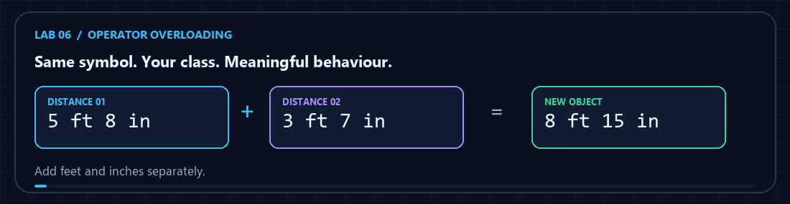

<div align="center">

<picture>
  <source media="(prefers-reduced-motion: reduce)" srcset="assets/oop_lab_banner_preview.png">
  
</picture>

# Object-Oriented Programming Laboratory

**Small programs. Clear concepts. One step closer to fluent C++.**


**IIIT Bhubaneswar** · Object Oriented Programming · C / C++

[Explore the labs](#laboratory-map) &nbsp; / &nbsp; [New: Lab 6](./LAB%206/) &nbsp; / &nbsp; [Lab Exam-1](./Lab%20Exam-1/) &nbsp; / &nbsp; [Run a program](#quick-start)

</div>

---

## Laboratory map

From structures and records to classes, memory, and operator overloading. Each folder contains ten independent programs and a guide to the concepts behind them.

| Module | What you will practise | Concepts | Open |
|:---|:---|:---|:---:|
| **01 · Structures & Records** | Organise related data | Structures · nested records · arrays | [Lab 1 →](./LAB%201/) |
| **02 · Classes & Objects** | Model data and behaviour together | Encapsulation · private data · member functions | [Lab 2 →](./LAB%202/) |
| **03 · Dynamic Memory** | Allocate arrays and matrices at runtime | `new` · `delete` · memory ownership | [Lab 3 →](./Lab3/) |
| **04 · Friends** | Give selected functions and classes private access | Friend functions · friend classes | [Lab 4 →](./LAB%204/) |
| **05 · Function Overloading** | Give one function name multiple signatures | Parameters · overload resolution | [Lab 5 →](./LAB%205/) |
| **06 · Operator Overloading** ✦ | Add distances, compare objects, combine inventory | `+` · `-` · `>` · `<` · `++` · `==` | [Lab 6 →](./LAB%206/) |
| **Lab Exam-1 · C++ Pointers** | Trace addresses and traverse arrays | Dereferencing · pointer arithmetic · dynamic arrays | [Exam →](./Lab%20Exam-1/) |

> **Folder update:** the earlier pointer-based `LAB 6` is now **[Lab Exam-1](./Lab%20Exam-1/)**, with sources named `LE1P1.cpp`–`LE1P10.cpp`. The new **[LAB 6](./LAB%206/)** follows the operator-overloading worksheet dated **29 September 2026**, Group **B2**.

## In focus: operators that understand your objects

`Distance + Distance` can mean more than adding two numbers. An overloaded operator combines the data and returns a useful new object.

<picture>
  <source media="(prefers-reduced-motion: reduce)" srcset="assets/operator_overloading_preview.png">
  
</picture>

```cpp
Distance operator+(const Distance& other) const {
    // The constructor converts every 12 inches into one foot.
    return Distance(feet + other.feet, inches + other.inches);
}

const Distance result = first + second;
```

| Create a new value | Ask a question | Change a counter |
|:---|:---|:---|
| Add distances and times | Which student has higher marks? | `++counter` returns the updated object |
| Subtract complex numbers | Are these dates equal? | `counter++` returns the previous value |
| Negate a number or merge inventory | Which product has greater total value? | Both increment the original counter |

[**Explore all ten operator-overloading exercises →**](./LAB%206/README.md)

## Quick start

You need a C++17 compiler such as GCC. Every source file has its own `main()`, so compile one exercise at a time.

```bash
git clone https://github.com/b425050-prog/b425050.git
cd "b425050/LAB 6"
g++ -std=c++17 -Wall -Wextra -pedantic L6P1.cpp -o L6P1
./L6P1
```

On **Windows PowerShell**, compile and run with:

```powershell
g++ -std=c++17 -Wall -Wextra -pedantic L6P1.cpp -o L6P1.exe
.\L6P1.exe
```

Try `5 8` for the first distance and `3 7` for the second. The result is **9 feet 3 inches**. Replace `P1` with `P2`–`P10` to try the remaining exercises.

<details>
<summary><b>Compile all new Lab 6 programs in PowerShell</b></summary>

From the `LAB 6` folder:

```powershell
New-Item -ItemType Directory -Force build | Out-Null
1..10 | ForEach-Object {
    g++ -std=c++17 -Wall -Wextra -pedantic "L6P$_.cpp" -o "build/L6P$_.exe"
    if ($LASTEXITCODE -ne 0) { throw "Compilation failed for L6P$_.cpp" }
}
.\build\L6P1.exe
```

</details>

## Find your way around

```text
b425050/
├── README.md          Start here
├── assets/            Local animations and still-image alternatives
├── LAB 1/             Structures and records
├── LAB 2/             Classes and objects
├── Lab3/              Dynamic memory allocation
├── LAB 4/             Friend functions and classes
├── LAB 5/             Function overloading
├── LAB 6/             Operator overloading · L6P1.cpp–L6P10.cpp
└── Lab Exam-1/        C++ pointers · LE1P1.cpp–LE1P10.cpp
```

## A useful way to study

1. **Read** the exercise and identify the class and its data.
2. **Predict** the output before running the program.
3. **Experiment** with equal values, zeroes, carries, and mismatched items.
4. **Explain** which operator runs and whether the original object changes.

The new Lab 6 guide includes sample inputs, expected results, and short viva notes. Its arithmetic operators return new objects, comparison operators return `bool`, and the counter demonstrates the different prefix and postfix return values.

---

<div align="center">

**Read it. Run it. Change it. Understand it.**

International Institute of Information Technology, Bhubaneswar

<sub>Animations live in this repository, with static alternatives for reduced-motion preferences.</sub>

</div>
